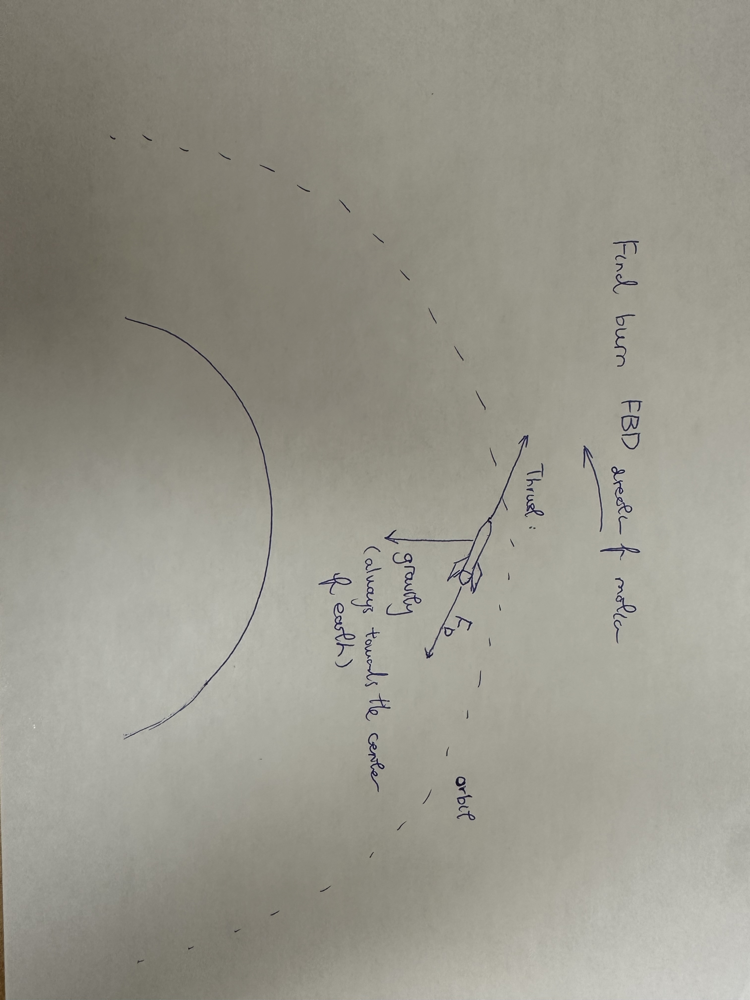
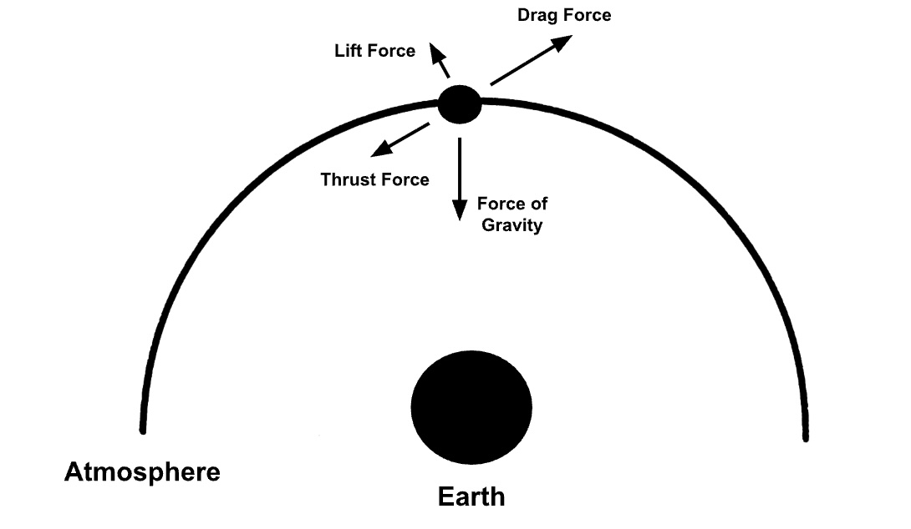
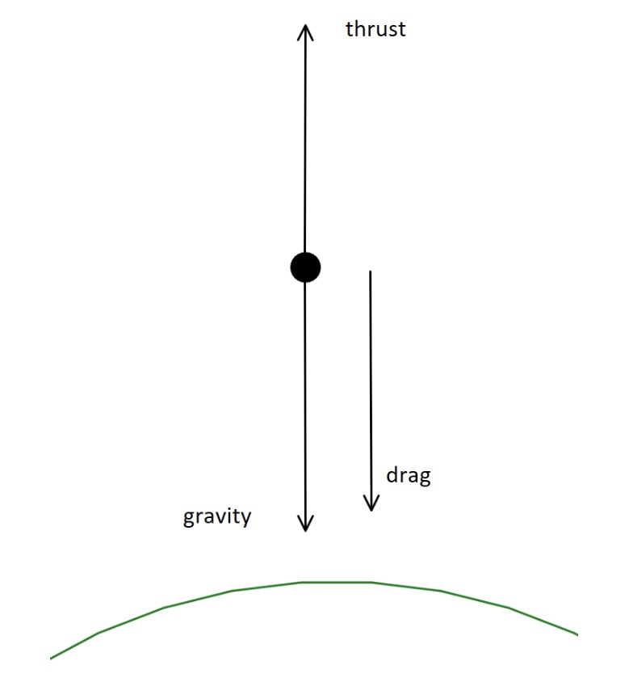

# ISS D_Milestone: Domain Knowledge
## What is the ISS? Give some historical context.
The International Space Station (ISS) is a permanently crewed, modular, orbiting laboratory for scientific research, technological development, and human space exploration. A joint project between the U.S., Canada, Russia, Japan, and various European nations, the ISS serves as a symbol of international cooperation and unified scientific progress.
In 1984, Congress provided funding for a space station dubbed Freedom, and construction of its components began in the US, Canada, Japan, and Europe. Following the failure of Freedom’s construction, in 1993, the Russians were invited to the project, and the official plans for the ISS were announced. The first model of the ISS, called Zarya, was launched in 1997, and over time, additional components were launched and added to expand the ISS. In 2000, the first crew arrived at the station, and it has been continuously manned by astronauts and researchers ever since.
The ISS serves as a microgravity lab for research covering human health in space, physics and materials science in microgravity, Earth observation and climate research, and testing of technology for deep-space missions.
[Source](https://www.nasa.gov/international-space-station/) 

## What are the considerations for its decommission?
Due to the constant dynamic loads and thermal changes that the ISS faces, its constituent components, including modules, radiators, and truss structures, have a limited technical lifetime. As the working lifetime of these components comes to an end, NASA must consider what to do with the ISS. Possible options include disassembly and return to Earth, boosting to higher orbit, natural orbital decay with random re-entry, and controlled targeted re-entry. NASA has determined that the safest and most cost-effective plan is to conduct a controlled, targeted re-entry into a remote ocean area. This method strikes a good balance between cost-effectiveness and safety: it avoids the large propellant requirements of orbital boosting or disassembly and return, while intentional control of the deorbit location drastically reduces the risk of collision with infrastructure and people.

## Describe the planned process broadly, defining orbital decay, LEO, deorbit, and controlled re-entry.
- Orbital decay: The gradual decrease in the altitude of a satellite's orbit over an extended period of time, resulting in a decline from its original stable position. [Source](https://taylorandfrancis.com/knowledge/Engineering_and_technology/Engineering_support_and_special_topics/Orbital_decay/)

- LEO (Low Earth Orbit): An orbit around the Earth with an altitude that lies towards the lower end of the range of possible orbits. [Source](https://www.space.com/low-earth-orbit)

- Deorbit: The act or process of deliberately leaving an orbital path, especially when a spacecraft is made to descend from its orbit, either to return to Earth or to eventually burn up in the atmosphere. [Source](https://www.dictionary.com/browse/deorbit)

- Controlled re-entry: Where the re-entry point is actively controlled to ensure that large fragments that survive re-entry do not pose an unacceptable hazard to people on the ground. [Source](https://www.sciencedirect.com/science/article/abs/pii/S0094576524006143)

## What are the factors that determine safety? [Source for whole question](https://www.nasa.gov/wp-content/uploads/2024/06/iss-deorbit-analysis-summary.pdf)

- **Public Risk from Debris Impact**:
   - Regulations - U.S. gov requires the probability of casualty to the public from reentry debris to be no more than 1 in 10,000 for a reentering spacecraft
   - ISS is a large spacecraft; uncontrolled reentry would yield the chance for large debris and a large debris footprint in unwanted areas
- **Targeting Accuracy** - It will be vital to accurately target where debris will land:
   - Uncertainties in breakup/fragmentation must be accounted for in trajectory planning
- **ISS Structural Integrity** - ISS will be descending into a denser atmosphere where structural loads, aerodynamic heating, and breakup dynamics determine how debris breaks up and which pieces survive:
   - The altitude at which break-up occurs influences the debris footprint and surviving pieces
- **Integration of deorbit helper vehicle** - the helper vehicle must attach to the ISS before reentry:
   - The deorbit vehicle needs to remain functional/stable during deorbit
   - Propellant capabilities - enough propellant must be available for the deorbit
- **Altitude/Window Timing (Ensuring debris falls over safe zones upon atmospheric entry)** - The atmospheric entry must be correctly timed based odd off the descent trajectories of debris into the safe zones (generally an ocean)
- **Fragmentation of debris** - There is high uncertainty in how the ISS structure can break up
- **Ballistic coefficients** - How easily an object moves through the atmosphere

## For each team member’s role, what physical laws apply, and what forces are important?

### Orbital decay
- Physical Laws
   - Newton’s Laws of Motion
   - Newton’s Law of Universal Gravitation
   - Conservation of Angular Momentum
   - Laws of Thermodynamics
   - Laws of Fluid Dynamics
   - Ballistic Coefficient
- Forces [Source](https://fiveable.me/key-terms/astrophysics-ii/orbital-decay)
   - Gravity
   - Atmospheric Drag
   - Solar Radiation Pressure (Near Negligible)
   - Gravitational Perturbations (Near Negligible)

### Final burn
- Laws
   - Mass flow rate of exhaustion
   - Newton's law of gravitation
   - Equation of drag
   - Conservation of momentum
   - Conservation of energy
   - Equation of circular motion
- Forces [Source](https://www1.grc.nasa.gov/beginners-guide-to-aeronautics/four-rocket-forces/)
   - Force experienced Gravitational field strength
   - Thrust
   - Drag

### Re-entry trajectory
- Classical Mechanics
   - Newton's Laws of Motion
   - Drag force
   - Ballistic Coefficient
   - Atmospheric Density Variation
   - Thermodynamics
   - Trajectory Equations: [Source](https://ntrs.nasa.gov/api/citations/19800007820/downloads/19800007820.pdf)
       - dz/dtheta=-(k)(z)tanY - shows how altitude changes as the station moves along its trajectory
       - dv/dtheta=kZv(1+kz)-(2-v) - describes how normalized velocity changes along the trajectory
           - Normalized velocity (v = VV0) - scaled against the initial velocity of the re-entry phase
           - z - position variable
           - v - velocity variables
           - theta - range angle
           - Y - flight path angle
           - k - physical control parameter
           - Z normalized state variable

### Rocket trajectory
- Physical Laws
   - Newton’s 3rd law
   - Newton’s 2nd law
   - Newton’s 1st law
       - Balance of forces
   - Rocket Equation
- Forces
   - Gravity
   - Drag
   - Thrust
## Sketch a free-body diagram of each member’s physical model for this milestone.

- Orbital Decay:

- Final Burn

- Re-entry trajectory

- Rocket Trajectory

## Define numerical simulation, and describe the idea behind Euler’s method, using a figure.

A numerical simulation is a computational approach that approximates the behavior of complex systems using numerical methods and mathematical models. It allows scientists to study equations and physical systems that are too complex for exact analytical solutions. Euler’s method is a technique used to solve ordinary differential equations. It works by using the tangent at a known point to estimate the value of the function at the next point, gradually replacing the curve with a straight-line approximation.
[Source](https://www.3d-scantech.com/solution/numerical-simulation/)
[Source](https://tutorial.math.lamar.edu/classes/de/eulersmethod.aspx) 

