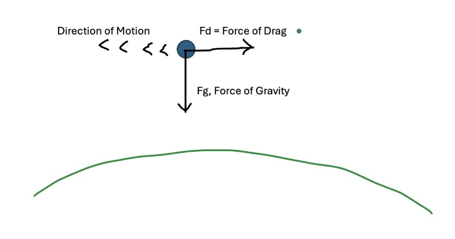
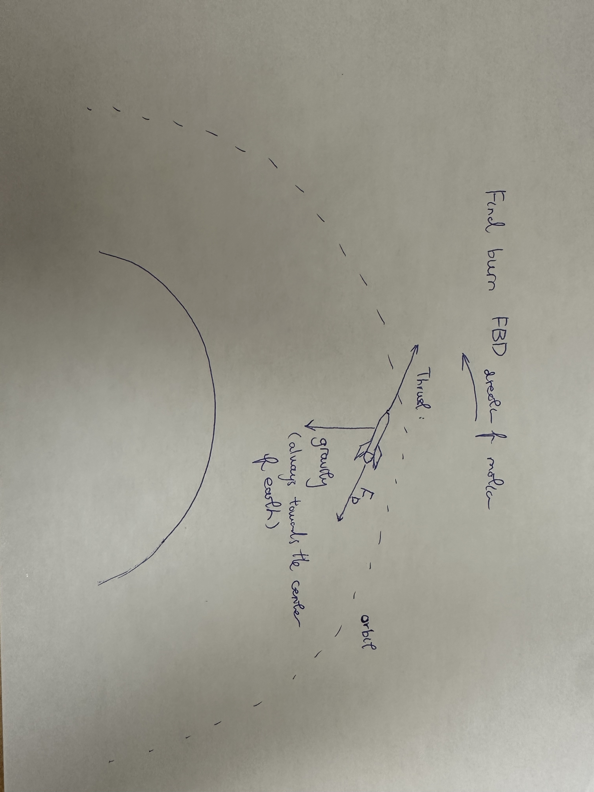
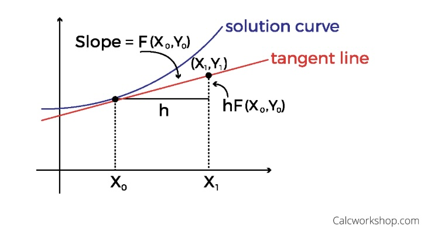

# ISS Deorbit Simulation

A numerical physics simulation of the International Space Station's planned controlled, targeted re-entry — modeling the station's trajectory from stable orbit through atmospheric breakup, and the launch of the deorbit support vehicle, using progressively more sophisticated numerical integration methods.

## Overview

NASA has determined that the ISS, nearing the end of its operational lifetime, will be safely deorbited via a controlled, targeted re-entry into a remote ocean area rather than disassembly, orbital boosting, or an uncontrolled natural decay. This project simulates that deorbit process end-to-end, broken into four physical stages:

1. **Orbital Decay** — the ISS's altitude gradually decreases under gravity and atmospheric drag.
2. **Final Burn** — a deorbit vehicle docked to the ISS fires its thrusters to actively lower the station's orbit.
3. **Re-entry Trajectory** — the station descends into denser atmosphere; at 100 km altitude the truss structure separates from the main body and the two are tracked independently to impact/splashdown.
4. **Rocket Trajectory** — an independent 1D launch simulation of the vehicle that carries the deorbit hardware up to meet the ISS.

Each stage is governed by different dominant forces (gravity, atmospheric drag, thrust) and is modeled as a system of ODEs, solved numerically rather than analytically, since the combined equations of motion have no closed-form solution.

## Repository Structure

The project was built in four iterative milestones, each folder representing a stage of development (see "Project History" below for what changed at each step):

```
d_ms/                        # domain research: physical laws, free-body diagrams, safety analysis
  D_Milestone.md
  images/
    EulersMethod.jpg
    OrbitalDecay.jpg
    final_burn.jpg
    Re-entryTrajectory.jpg
    RocketTractory.jpg

c_ms/                         # first working prototypes, one file per stage (independent, Euler's method)
  orbital_decay.py
  final_burn.py
  reentry_C_.py
  reentry_testing.py
  rocket.py
  plot.py
  constants.py

b_ms/                         # stages chained into one integrated simulation (Euler's method)
  full_simulation_file.py
  orbital_decay_B_.py
  final_burn_B_.py
  reentry_B_.py
  rocket_B.py
  test_full_simulation.py
  plot.py
  constants.py

a_ms/                         # final version: RK4 integration, modular acceleration functions
  A_milestone_final_simulation.py
  A_ms_plotting.py
  Runge_Kutta_Integration_Interface.py
  Orbital_Decay_Acceleration_Function.py
  Final_Burn_Acceleration_Function.py
  Reentry_Acceleration_Function.py
  Rocket_Trajectory_Acceleration_Function.py
  test_A_ms_simulation.py
  plot.py
  constants.py

README.md                    # this file
```

> All five `.jpg` files (free-body diagrams and the Euler's method figure) live in `d_ms/images/` alongside `D_Milestone.md`.

## Physical Model

Each stage has its own dominant forces and free-body diagram, developed during the initial domain-research phase (`d_ms/D_Milestone.md`):

**Orbital Decay** — gravity and atmospheric drag slowly lower the station's altitude.



**Final Burn** — the deorbit vehicle's thrust is added to gravity and drag to actively deorbit the station.



**Re-entry Trajectory** — as the station descends into thicker atmosphere, drag dominates; the truss separates from the main structure and both are tracked to impact.


**Rocket Trajectory** — the launch vehicle experiences thrust, drag, and gravity along a 1D vertical ascent.


Full physical background, relevant laws (Newtonian mechanics, gravitation, drag, rocket equation), and safety/regulatory considerations (debris casualty risk limits, targeting accuracy, structural breakup) are documented in [`d_ms/D_Milestone.md`](d_ms/D_Milestone.md).

## Numerical Methods

The project deliberately evolved its numerical approach across milestones:

- **Milestones C & B** use **explicit Euler's method** — each step advances position and velocity using the tangent (slope) at the current point.

  

- **Milestone A** upgrades every stage to a shared **4th-order Runge-Kutta (RK4)** integrator (`Runge_Kutta_Integration_Interface.py`), which samples the derivative at four points per step for a far more accurate approximation, especially over long integration windows like orbital decay. This required refactoring each stage into a standalone acceleration function (`f(pos, vel) -> accel`) that the shared integrator calls, rather than each stage owning its own integration loop.

## Usage (current version — `a_ms`)

```bash
cd a_ms
python A_milestone_final_simulation.py <altitude_m> <velocity_m/s> <timestep_s> <orbital_decay_time_min> <final_burn_time_min>

# example
python A_milestone_final_simulation.py 275e3 7700 0.1 90 60
```

This runs all three ISS-trajectory stages (orbital decay → final burn → re-entry) plus the independent rocket launch stage, and produces a plot showing the station/truss trajectory relative to Earth alongside the rocket's altitude-vs-time profile. The function returns a status string — `'orbiting or escaped orbit'`, `'hit ground'`, or `'invalid tstep value'` — describing the outcome.

## Testing

Each milestone includes its own test suite (`test_A_ms_simulation.py`, `test_full_simulation.py`, `reentry_testing.py`), following the same pattern: parametrized test cases assert an expected status string (`'hit ground'`, `'orbiting or escaped orbit'`, `'invalid tstep value'`, `'unit converter error'`, etc.) against simulation output, covering:

- Orbit vs. impact behavior across a range of initial altitudes and velocities
- Input validation (negative/zero timesteps, invalid units, invalid step counts)
- Edge cases (zero initial altitude, very large timesteps, unit conversions across km/m/cm/ft/miles)

## Project History

| Milestone | Focus | Integration Method |
|---|---|---|
| **D** | Domain research: physics, forces, free-body diagrams, safety requirements | — |
| **C** | First working prototypes of each stage, built and tested independently | Euler's method |
| **B** | Integration of all four stages into a single chained simulation with unit handling | Euler's method |
| **A** | Refactor to a shared numerical integrator; higher-order accuracy; separation/impact interpolation | Runge-Kutta 4 (RK4) |

## Authors

Pierson Jones, Justin Fu, Reid Korva, Rohan Deshmukh

## AI Statement

No AI was used in the development of the simulation code or the domain-research writing.
